4° Relatório Final

<strong>Jefferson Michael de Azevedo Junior</strong>

[comment]: <> 
Ra: <strong>2058979</strong>

## **Topologia da Rede**
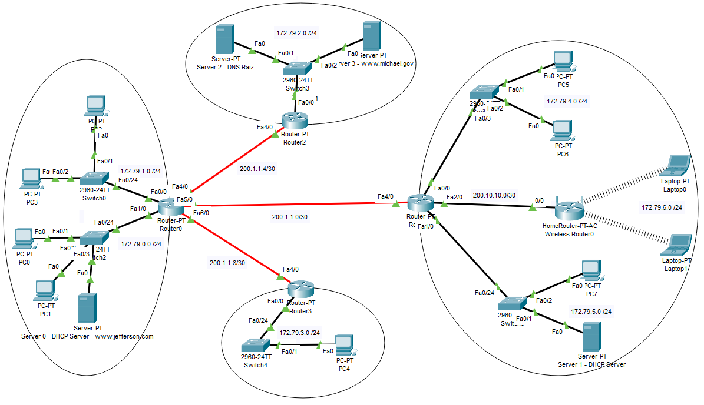

## **Tabela de endereçamento IP**
### Hosts
<table style="border-collapse:collapse;border-spacing:0;margin:0px auto" class="tg"><thead><tr><th style="border-color:#343434;border-style:solid;border-width:1px;font-family:Arial, sans-serif;font-size:14px;font-weight:bold;overflow:hidden;padding:10px 5px;text-align:center;vertical-align:middle;word-break:normal">Equipamento</th><th style="border-color:#343434;border-style:solid;border-width:1px;font-family:Arial, sans-serif;font-size:14px;font-weight:bold;overflow:hidden;padding:10px 5px;text-align:center;vertical-align:middle;word-break:normal">Endereço IP</th><th style="border-color:#343434;border-style:solid;border-width:1px;font-family:Arial, sans-serif;font-size:14px;font-weight:bold;overflow:hidden;padding:10px 5px;text-align:center;vertical-align:middle;word-break:normal" colspan="2">Máscara</th><th style="border-color:#343434;border-style:solid;border-width:1px;font-family:Arial, sans-serif;font-size:14px;font-weight:bold;overflow:hidden;padding:10px 5px;text-align:center;vertical-align:middle;word-break:normal">Gateway</th></tr></thead><tbody><tr><td style="border-color:#343434;border-style:solid;border-width:1px;font-family:Arial, sans-serif;font-size:14px;overflow:hidden;padding:10px 5px;text-align:center;vertical-align:middle;word-break:normal">Server0</td><td style="border-color:#343434;border-style:solid;border-width:1px;font-family:Arial, sans-serif;font-size:14px;overflow:hidden;padding:10px 5px;text-align:center;vertical-align:middle;word-break:normal">172.79.0.2</td><td style="border-color:#343434;border-style:solid;border-width:1px;font-family:Arial, sans-serif;font-size:14px;overflow:hidden;padding:10px 5px;text-align:center;vertical-align:middle;word-break:normal">255.255.255.0</td><td style="border-color:#343434;border-style:solid;border-width:1px;font-family:Arial, sans-serif;font-size:14px;overflow:hidden;padding:10px 5px;text-align:center;vertical-align:middle;word-break:normal">/24</td><td style="border-color:#343434;border-style:solid;border-width:1px;font-family:Arial, sans-serif;font-size:14px;overflow:hidden;padding:10px 5px;text-align:center;vertical-align:middle;word-break:normal">172.79.0.1</td></tr><tr><td style="border-color:#343434;border-style:solid;border-width:1px;font-family:Arial, sans-serif;font-size:14px;overflow:hidden;padding:10px 5px;text-align:center;vertical-align:middle;word-break:normal">PC0</td><td style="border-color:#343434;border-style:solid;border-width:1px;font-family:Arial, sans-serif;font-size:14px;overflow:hidden;padding:10px 5px;text-align:center;vertical-align:middle;word-break:normal">DHCP</td><td style="border-color:#343434;border-style:solid;border-width:1px;font-family:Arial, sans-serif;font-size:14px;overflow:hidden;padding:10px 5px;text-align:center;vertical-align:middle;word-break:normal">255.255.255.0</td><td style="border-color:#343434;border-style:solid;border-width:1px;font-family:Arial, sans-serif;font-size:14px;overflow:hidden;padding:10px 5px;text-align:center;vertical-align:middle;word-break:normal">/24</td><td style="border-color:#343434;border-style:solid;border-width:1px;font-family:Arial, sans-serif;font-size:14px;overflow:hidden;padding:10px 5px;text-align:center;vertical-align:middle;word-break:normal">172.79.0.1</td></tr><tr><td style="border-color:#343434;border-style:solid;border-width:1px;font-family:Arial, sans-serif;font-size:14px;overflow:hidden;padding:10px 5px;text-align:center;vertical-align:middle;word-break:normal">PC1</td><td style="border-color:#343434;border-style:solid;border-width:1px;font-family:Arial, sans-serif;font-size:14px;overflow:hidden;padding:10px 5px;text-align:center;vertical-align:middle;word-break:normal">DHCP</td><td style="border-color:#343434;border-style:solid;border-width:1px;font-family:Arial, sans-serif;font-size:14px;overflow:hidden;padding:10px 5px;text-align:center;vertical-align:middle;word-break:normal">255.255.255.0</td><td style="border-color:#343434;border-style:solid;border-width:1px;font-family:Arial, sans-serif;font-size:14px;overflow:hidden;padding:10px 5px;text-align:center;vertical-align:middle;word-break:normal">/24</td><td style="border-color:#343434;border-style:solid;border-width:1px;font-family:Arial, sans-serif;font-size:14px;overflow:hidden;padding:10px 5px;text-align:center;vertical-align:middle;word-break:normal">172.79.0.1</td></tr><tr><td style="border-color:#343434;border-style:solid;border-width:1px;font-family:Arial, sans-serif;font-size:14px;overflow:hidden;padding:10px 5px;text-align:center;vertical-align:middle;word-break:normal" colspan="5"></td></tr><tr><td style="border-color:#343434;border-style:solid;border-width:1px;font-family:Arial, sans-serif;font-size:14px;overflow:hidden;padding:10px 5px;text-align:center;vertical-align:middle;word-break:normal">PC2</td><td style="border-color:#343434;border-style:solid;border-width:1px;font-family:Arial, sans-serif;font-size:14px;overflow:hidden;padding:10px 5px;text-align:center;vertical-align:middle;word-break:normal">172.79.1.2</td><td style="border-color:#343434;border-style:solid;border-width:1px;font-family:Arial, sans-serif;font-size:14px;overflow:hidden;padding:10px 5px;text-align:center;vertical-align:middle;word-break:normal">255.255.255.0</td><td style="border-color:#343434;border-style:solid;border-width:1px;font-family:Arial, sans-serif;font-size:14px;overflow:hidden;padding:10px 5px;text-align:center;vertical-align:middle;word-break:normal">/24</td><td style="border-color:#343434;border-style:solid;border-width:1px;font-family:Arial, sans-serif;font-size:14px;overflow:hidden;padding:10px 5px;text-align:center;vertical-align:middle;word-break:normal">172.79.1.1</td></tr><tr><td style="border-color:#343434;border-style:solid;border-width:1px;font-family:Arial, sans-serif;font-size:14px;overflow:hidden;padding:10px 5px;text-align:center;vertical-align:middle;word-break:normal">PC3</td><td style="border-color:#343434;border-style:solid;border-width:1px;font-family:Arial, sans-serif;font-size:14px;overflow:hidden;padding:10px 5px;text-align:center;vertical-align:middle;word-break:normal">172.79.1.3</td><td style="border-color:#343434;border-style:solid;border-width:1px;font-family:Arial, sans-serif;font-size:14px;overflow:hidden;padding:10px 5px;text-align:center;vertical-align:middle;word-break:normal">255.255.255.0</td><td style="border-color:#343434;border-style:solid;border-width:1px;font-family:Arial, sans-serif;font-size:14px;overflow:hidden;padding:10px 5px;text-align:center;vertical-align:middle;word-break:normal">/24</td><td style="border-color:#343434;border-style:solid;border-width:1px;font-family:Arial, sans-serif;font-size:14px;overflow:hidden;padding:10px 5px;text-align:center;vertical-align:middle;word-break:normal">172.79.1.1</td></tr><tr><td style="border-color:#343434;border-style:solid;border-width:1px;font-family:Arial, sans-serif;font-size:14px;overflow:hidden;padding:10px 5px;text-align:center;vertical-align:middle;word-break:normal" colspan="5"></td></tr><tr><td style="border-color:#343434;border-style:solid;border-width:1px;font-family:Arial, sans-serif;font-size:14px;overflow:hidden;padding:10px 5px;text-align:center;vertical-align:middle;word-break:normal">PC4</td><td style="border-color:#343434;border-style:solid;border-width:1px;font-family:Arial, sans-serif;font-size:14px;overflow:hidden;padding:10px 5px;text-align:center;vertical-align:middle;word-break:normal">172.79.3.2</td><td style="border-color:#343434;border-style:solid;border-width:1px;font-family:Arial, sans-serif;font-size:14px;overflow:hidden;padding:10px 5px;text-align:center;vertical-align:middle;word-break:normal">255.255.255.0</td><td style="border-color:#343434;border-style:solid;border-width:1px;font-family:Arial, sans-serif;font-size:14px;overflow:hidden;padding:10px 5px;text-align:center;vertical-align:middle;word-break:normal">/24</td><td style="border-color:#343434;border-style:solid;border-width:1px;font-family:Arial, sans-serif;font-size:14px;overflow:hidden;padding:10px 5px;text-align:center;vertical-align:middle;word-break:normal">172.79.3.1</td></tr><tr><td style="border-color:#343434;border-style:solid;border-width:1px;font-family:Arial, sans-serif;font-size:14px;overflow:hidden;padding:10px 5px;text-align:center;vertical-align:middle;word-break:normal" colspan="5"></td></tr><tr><td style="border-color:#343434;border-style:solid;border-width:1px;font-family:Arial, sans-serif;font-size:14px;overflow:hidden;padding:10px 5px;text-align:center;vertical-align:middle;word-break:normal">PC5</td><td style="border-color:#343434;border-style:solid;border-width:1px;font-family:Arial, sans-serif;font-size:14px;overflow:hidden;padding:10px 5px;text-align:center;vertical-align:middle;word-break:normal">172.79.4.2</td><td style="border-color:#343434;border-style:solid;border-width:1px;font-family:Arial, sans-serif;font-size:14px;overflow:hidden;padding:10px 5px;text-align:center;vertical-align:middle;word-break:normal">255.255.255.0</td><td style="border-color:#343434;border-style:solid;border-width:1px;font-family:Arial, sans-serif;font-size:14px;overflow:hidden;padding:10px 5px;text-align:center;vertical-align:middle;word-break:normal">/24</td><td style="border-color:#343434;border-style:solid;border-width:1px;font-family:Arial, sans-serif;font-size:14px;overflow:hidden;padding:10px 5px;text-align:center;vertical-align:middle;word-break:normal">172.79.4.1</td></tr><tr><td style="border-color:#343434;border-style:solid;border-width:1px;font-family:Arial, sans-serif;font-size:14px;overflow:hidden;padding:10px 5px;text-align:center;vertical-align:middle;word-break:normal">PC6</td><td style="border-color:#343434;border-style:solid;border-width:1px;font-family:Arial, sans-serif;font-size:14px;overflow:hidden;padding:10px 5px;text-align:center;vertical-align:middle;word-break:normal">172.79.4.3</td><td style="border-color:#343434;border-style:solid;border-width:1px;font-family:Arial, sans-serif;font-size:14px;overflow:hidden;padding:10px 5px;text-align:center;vertical-align:middle;word-break:normal">255.255.255.0</td><td style="border-color:#343434;border-style:solid;border-width:1px;font-family:Arial, sans-serif;font-size:14px;overflow:hidden;padding:10px 5px;text-align:center;vertical-align:middle;word-break:normal">/24</td><td style="border-color:#343434;border-style:solid;border-width:1px;font-family:Arial, sans-serif;font-size:14px;overflow:hidden;padding:10px 5px;text-align:center;vertical-align:middle;word-break:normal">172.79.4.1</td></tr><tr><td style="border-color:#343434;border-style:solid;border-width:1px;font-family:Arial, sans-serif;font-size:14px;overflow:hidden;padding:10px 5px;text-align:center;vertical-align:middle;word-break:normal" colspan="5"></td></tr><tr><td style="border-color:#343434;border-style:solid;border-width:1px;font-family:Arial, sans-serif;font-size:14px;overflow:hidden;padding:10px 5px;text-align:center;vertical-align:middle;word-break:normal">Laptop0</td><td style="border-color:#343434;border-style:solid;border-width:1px;font-family:Arial, sans-serif;font-size:14px;overflow:hidden;padding:10px 5px;text-align:center;vertical-align:middle;word-break:normal">DHCP</td><td style="border-color:#343434;border-style:solid;border-width:1px;font-family:Arial, sans-serif;font-size:14px;overflow:hidden;padding:10px 5px;text-align:center;vertical-align:middle;word-break:normal">255.255.255.0</td><td style="border-color:#343434;border-style:solid;border-width:1px;font-family:Arial, sans-serif;font-size:14px;overflow:hidden;padding:10px 5px;text-align:center;vertical-align:middle;word-break:normal">/24</td><td style="border-color:#343434;border-style:solid;border-width:1px;font-family:Arial, sans-serif;font-size:14px;overflow:hidden;padding:10px 5px;text-align:center;vertical-align:middle;word-break:normal">172.79.6.1</td></tr><tr><td style="border-color:#343434;border-style:solid;border-width:1px;font-family:Arial, sans-serif;font-size:14px;overflow:hidden;padding:10px 5px;text-align:center;vertical-align:middle;word-break:normal">Laptop1</td><td style="border-color:#343434;border-style:solid;border-width:1px;font-family:Arial, sans-serif;font-size:14px;overflow:hidden;padding:10px 5px;text-align:center;vertical-align:middle;word-break:normal">DHCP</td><td style="border-color:#343434;border-style:solid;border-width:1px;font-family:Arial, sans-serif;font-size:14px;overflow:hidden;padding:10px 5px;text-align:center;vertical-align:middle;word-break:normal">255.255.255.0</td><td style="border-color:#343434;border-style:solid;border-width:1px;font-family:Arial, sans-serif;font-size:14px;overflow:hidden;padding:10px 5px;text-align:center;vertical-align:middle;word-break:normal">/24</td><td style="border-color:#343434;border-style:solid;border-width:1px;font-family:Arial, sans-serif;font-size:14px;overflow:hidden;padding:10px 5px;text-align:center;vertical-align:middle;word-break:normal">172.79.6.1</td></tr><tr><td style="border-color:#343434;border-style:solid;border-width:1px;font-family:Arial, sans-serif;font-size:14px;overflow:hidden;padding:10px 5px;text-align:center;vertical-align:middle;word-break:normal" colspan="5"></td></tr><tr><td style="border-color:#343434;border-style:solid;border-width:1px;font-family:Arial, sans-serif;font-size:14px;overflow:hidden;padding:10px 5px;text-align:center;vertical-align:middle;word-break:normal">PC7</td><td style="border-color:#343434;border-style:solid;border-width:1px;font-family:Arial, sans-serif;font-size:14px;overflow:hidden;padding:10px 5px;text-align:center;vertical-align:middle;word-break:normal">DHCP</td><td style="border-color:#343434;border-style:solid;border-width:1px;font-family:Arial, sans-serif;font-size:14px;overflow:hidden;padding:10px 5px;text-align:center;vertical-align:middle;word-break:normal">255.255.255.0</td><td style="border-color:#343434;border-style:solid;border-width:1px;font-family:Arial, sans-serif;font-size:14px;overflow:hidden;padding:10px 5px;text-align:center;vertical-align:middle;word-break:normal">/24</td><td style="border-color:#343434;border-style:solid;border-width:1px;font-family:Arial, sans-serif;font-size:14px;overflow:hidden;padding:10px 5px;text-align:center;vertical-align:middle;word-break:normal">172.79.5.1</td></tr><tr><td style="border-color:#343434;border-style:solid;border-width:1px;font-family:Arial, sans-serif;font-size:14px;overflow:hidden;padding:10px 5px;text-align:center;vertical-align:middle;word-break:normal">Server1</td><td style="border-color:#343434;border-style:solid;border-width:1px;font-family:Arial, sans-serif;font-size:14px;overflow:hidden;padding:10px 5px;text-align:center;vertical-align:middle;word-break:normal">172.79.5.2</td><td style="border-color:#343434;border-style:solid;border-width:1px;font-family:Arial, sans-serif;font-size:14px;overflow:hidden;padding:10px 5px;text-align:center;vertical-align:middle;word-break:normal">255.255.255.0</td><td style="border-color:#343434;border-style:solid;border-width:1px;font-family:Arial, sans-serif;font-size:14px;overflow:hidden;padding:10px 5px;text-align:center;vertical-align:middle;word-break:normal">/24</td><td style="border-color:#343434;border-style:solid;border-width:1px;font-family:Arial, sans-serif;font-size:14px;overflow:hidden;padding:10px 5px;text-align:center;vertical-align:middle;word-break:normal">172.79.5.1</td></tr><tr><td style="border-color:#343434;border-style:solid;border-width:1px;font-family:Arial, sans-serif;font-size:14px;overflow:hidden;padding:10px 5px;text-align:center;vertical-align:middle;word-break:normal" colspan="5"></td></tr><tr><td style="border-color:#343434;border-style:solid;border-width:1px;font-family:Arial, sans-serif;font-size:14px;overflow:hidden;padding:10px 5px;text-align:center;vertical-align:middle;word-break:normal">Server2</td><td style="border-color:#343434;border-style:solid;border-width:1px;font-family:Arial, sans-serif;font-size:14px;overflow:hidden;padding:10px 5px;text-align:center;vertical-align:middle;word-break:normal">172.79.2.2</td><td style="border-color:#343434;border-style:solid;border-width:1px;font-family:Arial, sans-serif;font-size:14px;overflow:hidden;padding:10px 5px;text-align:center;vertical-align:middle;word-break:normal">255.255.255.0</td><td style="border-color:#343434;border-style:solid;border-width:1px;font-family:Arial, sans-serif;font-size:14px;overflow:hidden;padding:10px 5px;text-align:center;vertical-align:middle;word-break:normal">/24</td><td style="border-color:#343434;border-style:solid;border-width:1px;font-family:Arial, sans-serif;font-size:14px;overflow:hidden;padding:10px 5px;text-align:center;vertical-align:middle;word-break:normal">172.79.2.1</td></tr><tr><td style="border-color:#343434;border-style:solid;border-width:1px;font-family:Arial, sans-serif;font-size:14px;overflow:hidden;padding:10px 5px;text-align:center;vertical-align:middle;word-break:normal">Server3</td><td style="border-color:#343434;border-style:solid;border-width:1px;font-family:Arial, sans-serif;font-size:14px;overflow:hidden;padding:10px 5px;text-align:center;vertical-align:middle;word-break:normal">172.79.2.3</td><td style="border-color:#343434;border-style:solid;border-width:1px;font-family:Arial, sans-serif;font-size:14px;overflow:hidden;padding:10px 5px;text-align:center;vertical-align:middle;word-break:normal">255.255.255.0</td><td style="border-color:#343434;border-style:solid;border-width:1px;font-family:Arial, sans-serif;font-size:14px;overflow:hidden;padding:10px 5px;text-align:center;vertical-align:middle;word-break:normal">/24</td><td style="border-color:#343434;border-style:solid;border-width:1px;font-family:Arial, sans-serif;font-size:14px;overflow:hidden;padding:10px 5px;text-align:center;vertical-align:middle;word-break:normal">172.79.2.1</td></tr></tbody></table>

### Routers
<table style="border-collapse:collapse;border-spacing:0;margin:0px auto" class="tg"><thead><tr><th style="border-color:#343434;border-style:solid;border-width:1px;font-family:Arial, sans-serif;font-size:14px;font-weight:bold;overflow:hidden;padding:10px 5px;text-align:center;vertical-align:middle;word-break:normal">Equipamento</th><th style="border-color:#343434;border-style:solid;border-width:1px;font-family:Arial, sans-serif;font-size:14px;font-weight:bold;overflow:hidden;padding:10px 5px;text-align:center;vertical-align:middle;word-break:normal">Endereço IP</th><th style="border-color:#343434;border-style:solid;border-width:1px;font-family:Arial, sans-serif;font-size:14px;font-weight:bold;overflow:hidden;padding:10px 5px;text-align:center;vertical-align:middle;word-break:normal" colspan="2">Máscara</th><th style="border-color:#343434;border-style:solid;border-width:1px;font-family:Arial, sans-serif;font-size:14px;font-weight:bold;overflow:hidden;padding:10px 5px;text-align:center;vertical-align:middle;word-break:normal">Gateway</th></tr></thead><tbody><tr><td style="border-color:#343434;border-style:solid;border-width:1px;font-family:Arial, sans-serif;font-size:14px;overflow:hidden;padding:10px 5px;text-align:center;vertical-align:middle;word-break:normal" rowspan="5">Router0</td><td style="border-color:#343434;border-style:solid;border-width:1px;font-family:Arial, sans-serif;font-size:14px;overflow:hidden;padding:10px 5px;text-align:center;vertical-align:middle;word-break:normal">172.79.1.1</td><td style="border-color:#343434;border-style:solid;border-width:1px;font-family:Arial, sans-serif;font-size:14px;overflow:hidden;padding:10px 5px;text-align:center;vertical-align:middle;word-break:normal">255.255.255.0</td><td style="border-color:#343434;border-style:solid;border-width:1px;font-family:Arial, sans-serif;font-size:14px;overflow:hidden;padding:10px 5px;text-align:center;vertical-align:middle;word-break:normal">/24</td><td style="border-color:#343434;border-style:solid;border-width:1px;font-family:Arial, sans-serif;font-size:14px;overflow:hidden;padding:10px 5px;text-align:center;vertical-align:middle;word-break:normal" rowspan="5">200.1.1.2 200.1.1.6 200.1.1.10</td></tr><tr><td style="border-color:#343434;border-style:solid;border-width:1px;font-family:Arial, sans-serif;font-size:14px;overflow:hidden;padding:10px 5px;text-align:center;vertical-align:middle;word-break:normal">172.79.0.1</td><td style="border-color:#343434;border-style:solid;border-width:1px;font-family:Arial, sans-serif;font-size:14px;overflow:hidden;padding:10px 5px;text-align:center;vertical-align:middle;word-break:normal">255.255.255.0</td><td style="border-color:#343434;border-style:solid;border-width:1px;font-family:Arial, sans-serif;font-size:14px;overflow:hidden;padding:10px 5px;text-align:center;vertical-align:middle;word-break:normal">/24</td></tr><tr><td style="border-color:#343434;border-style:solid;border-width:1px;font-family:Arial, sans-serif;font-size:14px;overflow:hidden;padding:10px 5px;text-align:center;vertical-align:middle;word-break:normal">200.1.1.5</td><td style="border-color:#343434;border-style:solid;border-width:1px;font-family:Arial, sans-serif;font-size:14px;overflow:hidden;padding:10px 5px;text-align:center;vertical-align:middle;word-break:normal">255.255.255.252</td><td style="border-color:#343434;border-style:solid;border-width:1px;font-family:Arial, sans-serif;font-size:14px;overflow:hidden;padding:10px 5px;text-align:center;vertical-align:middle;word-break:normal">/30</td></tr><tr><td style="border-color:#343434;border-style:solid;border-width:1px;font-family:Arial, sans-serif;font-size:14px;overflow:hidden;padding:10px 5px;text-align:center;vertical-align:middle;word-break:normal">200.1.1.1</td><td style="border-color:#343434;border-style:solid;border-width:1px;font-family:Arial, sans-serif;font-size:14px;overflow:hidden;padding:10px 5px;text-align:center;vertical-align:middle;word-break:normal">255.255.255.252</td><td style="border-color:#343434;border-style:solid;border-width:1px;font-family:Arial, sans-serif;font-size:14px;overflow:hidden;padding:10px 5px;text-align:center;vertical-align:middle;word-break:normal">/30</td></tr><tr><td style="border-color:#343434;border-style:solid;border-width:1px;font-family:Arial, sans-serif;font-size:14px;overflow:hidden;padding:10px 5px;text-align:center;vertical-align:middle;word-break:normal">200.1.1.9</td><td style="border-color:#343434;border-style:solid;border-width:1px;font-family:Arial, sans-serif;font-size:14px;overflow:hidden;padding:10px 5px;text-align:center;vertical-align:middle;word-break:normal">255.255.255.252</td><td style="border-color:#343434;border-style:solid;border-width:1px;font-family:Arial, sans-serif;font-size:14px;overflow:hidden;padding:10px 5px;text-align:center;vertical-align:middle;word-break:normal">/30</td></tr><tr><td style="border-color:#343434;border-style:solid;border-width:1px;font-family:Arial, sans-serif;font-size:14px;overflow:hidden;padding:10px 5px;text-align:center;vertical-align:middle;word-break:normal" colspan="5"></td></tr><tr><td style="border-color:#343434;border-style:solid;border-width:1px;font-family:Arial, sans-serif;font-size:14px;overflow:hidden;padding:10px 5px;text-align:center;vertical-align:middle;word-break:normal" rowspan="4">Router1</td><td style="border-color:#343434;border-style:solid;border-width:1px;font-family:Arial, sans-serif;font-size:14px;overflow:hidden;padding:10px 5px;text-align:center;vertical-align:middle;word-break:normal">172.79.4.1</td><td style="border-color:#343434;border-style:solid;border-width:1px;font-family:Arial, sans-serif;font-size:14px;overflow:hidden;padding:10px 5px;text-align:center;vertical-align:middle;word-break:normal">255.255.255.0</td><td style="border-color:#343434;border-style:solid;border-width:1px;font-family:Arial, sans-serif;font-size:14px;overflow:hidden;padding:10px 5px;text-align:center;vertical-align:middle;word-break:normal">/24</td><td style="border-color:#343434;border-style:solid;border-width:1px;font-family:Arial, sans-serif;font-size:14px;overflow:hidden;padding:10px 5px;text-align:center;vertical-align:middle;word-break:normal" rowspan="4">200.1.1.1</td></tr><tr><td style="border-color:#343434;border-style:solid;border-width:1px;font-family:Arial, sans-serif;font-size:14px;overflow:hidden;padding:10px 5px;text-align:center;vertical-align:middle;word-break:normal">172.79.5.1</td><td style="border-color:#343434;border-style:solid;border-width:1px;font-family:Arial, sans-serif;font-size:14px;overflow:hidden;padding:10px 5px;text-align:center;vertical-align:middle;word-break:normal">255.255.255.0</td><td style="border-color:#343434;border-style:solid;border-width:1px;font-family:Arial, sans-serif;font-size:14px;overflow:hidden;padding:10px 5px;text-align:center;vertical-align:middle;word-break:normal">/24</td></tr><tr><td style="border-color:#343434;border-style:solid;border-width:1px;font-family:Arial, sans-serif;font-size:14px;overflow:hidden;padding:10px 5px;text-align:center;vertical-align:middle;word-break:normal">200.10.10.1</td><td style="border-color:#343434;border-style:solid;border-width:1px;font-family:Arial, sans-serif;font-size:14px;overflow:hidden;padding:10px 5px;text-align:center;vertical-align:middle;word-break:normal">255.255.255.252</td><td style="border-color:#343434;border-style:solid;border-width:1px;font-family:Arial, sans-serif;font-size:14px;overflow:hidden;padding:10px 5px;text-align:center;vertical-align:middle;word-break:normal">/30</td></tr><tr><td style="border-color:#343434;border-style:solid;border-width:1px;font-family:Arial, sans-serif;font-size:14px;overflow:hidden;padding:10px 5px;text-align:center;vertical-align:middle;word-break:normal">200.1.1.2</td><td style="border-color:#343434;border-style:solid;border-width:1px;font-family:Arial, sans-serif;font-size:14px;overflow:hidden;padding:10px 5px;text-align:center;vertical-align:middle;word-break:normal">255.255.255.252</td><td style="border-color:#343434;border-style:solid;border-width:1px;font-family:Arial, sans-serif;font-size:14px;overflow:hidden;padding:10px 5px;text-align:center;vertical-align:middle;word-break:normal">/30</td></tr><tr><td style="border-color:#343434;border-style:solid;border-width:1px;font-family:Arial, sans-serif;font-size:14px;overflow:hidden;padding:10px 5px;text-align:center;vertical-align:middle;word-break:normal" colspan="5"></td></tr><tr><td style="border-color:#343434;border-style:solid;border-width:1px;font-family:Arial, sans-serif;font-size:14px;overflow:hidden;padding:10px 5px;text-align:center;vertical-align:middle;word-break:normal" rowspan="2">Router2</td><td style="border-color:#343434;border-style:solid;border-width:1px;font-family:Arial, sans-serif;font-size:14px;overflow:hidden;padding:10px 5px;text-align:center;vertical-align:middle;word-break:normal">172.79.2.1</td><td style="border-color:#343434;border-style:solid;border-width:1px;font-family:Arial, sans-serif;font-size:14px;overflow:hidden;padding:10px 5px;text-align:center;vertical-align:middle;word-break:normal">255.255.255.0</td><td style="border-color:#343434;border-style:solid;border-width:1px;font-family:Arial, sans-serif;font-size:14px;overflow:hidden;padding:10px 5px;text-align:center;vertical-align:middle;word-break:normal">/24</td><td style="border-color:#343434;border-style:solid;border-width:1px;font-family:Arial, sans-serif;font-size:14px;overflow:hidden;padding:10px 5px;text-align:center;vertical-align:middle;word-break:normal" rowspan="2">200.1.1.5</td></tr><tr><td style="border-color:#343434;border-style:solid;border-width:1px;font-family:Arial, sans-serif;font-size:14px;overflow:hidden;padding:10px 5px;text-align:center;vertical-align:middle;word-break:normal">200.1.1.6</td><td style="border-color:#343434;border-style:solid;border-width:1px;font-family:Arial, sans-serif;font-size:14px;overflow:hidden;padding:10px 5px;text-align:center;vertical-align:middle;word-break:normal">255.255.255.252</td><td style="border-color:#343434;border-style:solid;border-width:1px;font-family:Arial, sans-serif;font-size:14px;overflow:hidden;padding:10px 5px;text-align:center;vertical-align:middle;word-break:normal">/30</td></tr><tr><td style="border-color:#343434;border-style:solid;border-width:1px;font-family:Arial, sans-serif;font-size:14px;overflow:hidden;padding:10px 5px;text-align:center;vertical-align:middle;word-break:normal" colspan="5"></td></tr><tr><td style="border-color:#343434;border-style:solid;border-width:1px;font-family:Arial, sans-serif;font-size:14px;overflow:hidden;padding:10px 5px;text-align:center;vertical-align:middle;word-break:normal" rowspan="2">Router3</td><td style="border-color:#343434;border-style:solid;border-width:1px;font-family:Arial, sans-serif;font-size:14px;overflow:hidden;padding:10px 5px;text-align:center;vertical-align:middle;word-break:normal">172.79.3.1</td><td style="border-color:#343434;border-style:solid;border-width:1px;font-family:Arial, sans-serif;font-size:14px;overflow:hidden;padding:10px 5px;text-align:center;vertical-align:middle;word-break:normal">255.255.255.0</td><td style="border-color:#343434;border-style:solid;border-width:1px;font-family:Arial, sans-serif;font-size:14px;overflow:hidden;padding:10px 5px;text-align:center;vertical-align:middle;word-break:normal">/24</td><td style="border-color:#343434;border-style:solid;border-width:1px;font-family:Arial, sans-serif;font-size:14px;overflow:hidden;padding:10px 5px;text-align:center;vertical-align:middle;word-break:normal" rowspan="2">200.1.1.9</td></tr><tr><td style="border-color:#343434;border-style:solid;border-width:1px;font-family:Arial, sans-serif;font-size:14px;overflow:hidden;padding:10px 5px;text-align:center;vertical-align:middle;word-break:normal">200.1.1.10</td><td style="border-color:#343434;border-style:solid;border-width:1px;font-family:Arial, sans-serif;font-size:14px;overflow:hidden;padding:10px 5px;text-align:center;vertical-align:middle;word-break:normal">255.255.255.252</td><td style="border-color:#343434;border-style:solid;border-width:1px;font-family:Arial, sans-serif;font-size:14px;overflow:hidden;padding:10px 5px;text-align:center;vertical-align:middle;word-break:normal">/30</td></tr><tr><td style="border-color:#343434;border-style:solid;border-width:1px;font-family:Arial, sans-serif;font-size:14px;overflow:hidden;padding:10px 5px;text-align:center;vertical-align:middle;word-break:normal" colspan="5"></td></tr><tr><td style="border-color:#343434;border-style:solid;border-width:1px;font-family:Arial, sans-serif;font-size:14px;overflow:hidden;padding:10px 5px;text-align:center;vertical-align:middle;word-break:normal" rowspan="2">Wireless Router0</td><td style="border-color:#343434;border-style:solid;border-width:1px;font-family:Arial, sans-serif;font-size:14px;overflow:hidden;padding:10px 5px;text-align:center;vertical-align:middle;word-break:normal">200.10.10.2</td><td style="border-color:#343434;border-style:solid;border-width:1px;font-family:Arial, sans-serif;font-size:14px;overflow:hidden;padding:10px 5px;text-align:center;vertical-align:middle;word-break:normal">255.255.255.252</td><td style="border-color:#343434;border-style:solid;border-width:1px;font-family:Arial, sans-serif;font-size:14px;overflow:hidden;padding:10px 5px;text-align:center;vertical-align:middle;word-break:normal">/30</td><td style="border-color:#343434;border-style:solid;border-width:1px;font-family:Arial, sans-serif;font-size:14px;overflow:hidden;padding:10px 5px;text-align:center;vertical-align:middle;word-break:normal" rowspan="2">200.10.10.1</td></tr><tr><td style="border-color:#343434;border-style:solid;border-width:1px;font-family:Arial, sans-serif;font-size:14px;overflow:hidden;padding:10px 5px;text-align:center;vertical-align:middle;word-break:normal">172.79.6.1</td><td style="border-color:#343434;border-style:solid;border-width:1px;font-family:Arial, sans-serif;font-size:14px;overflow:hidden;padding:10px 5px;text-align:center;vertical-align:middle;word-break:normal">255.255.255.0</td><td style="border-color:#343434;border-style:solid;border-width:1px;font-family:Arial, sans-serif;font-size:14px;overflow:hidden;padding:10px 5px;text-align:center;vertical-align:middle;word-break:normal">/24</td></tr></tbody></table>

## Tabela de rotas
### Router0
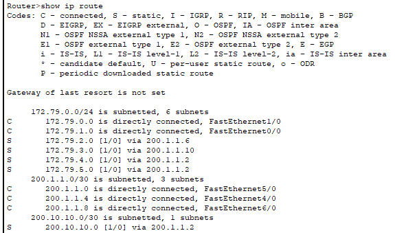
### Router1
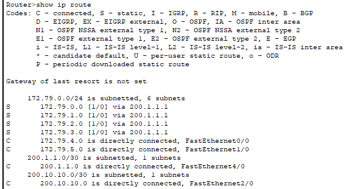
### Router2
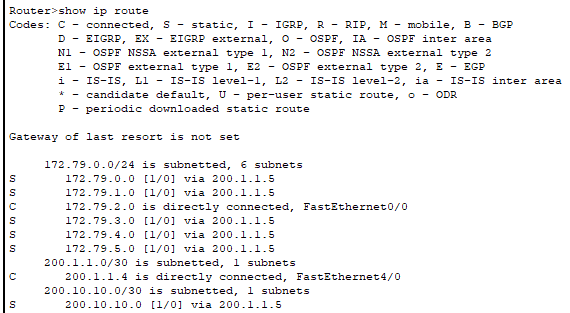
### Router3
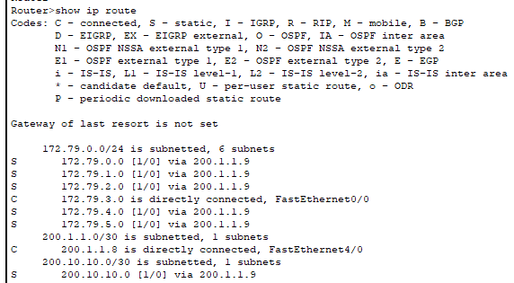

## Configurações DHCP
### Server0
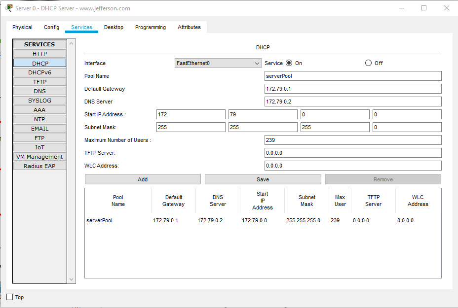
### Server1
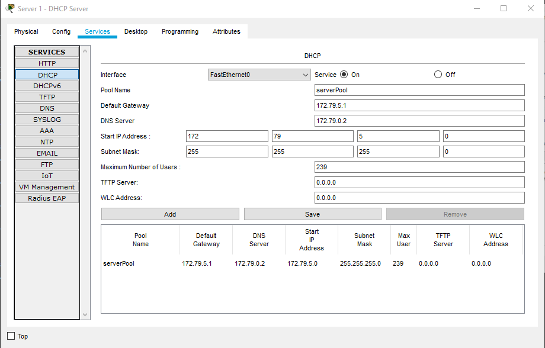
### Wireless Router0
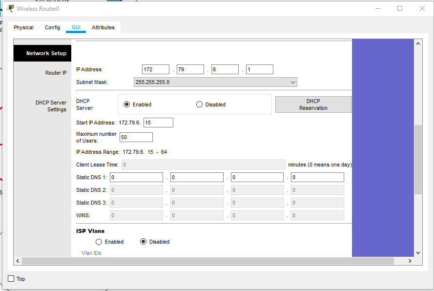

## Configurações DNS
- Todos os hosts usam o serviço de DNS local no Server0
### Server0 DNS Local
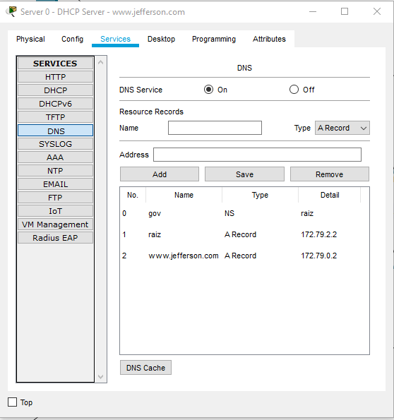
### Server2 DNS Raiz
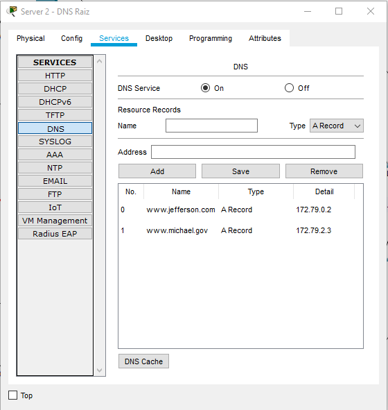

## Testando DNS
### www.jefferson.com
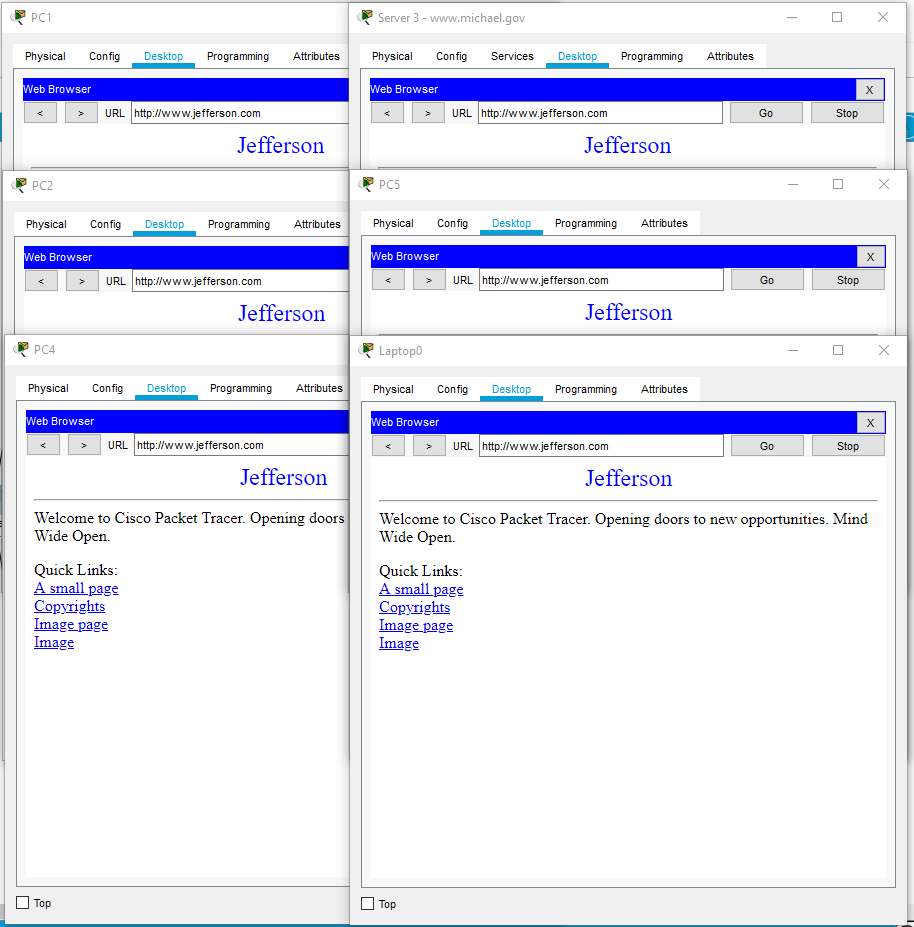
### www.michael.gov
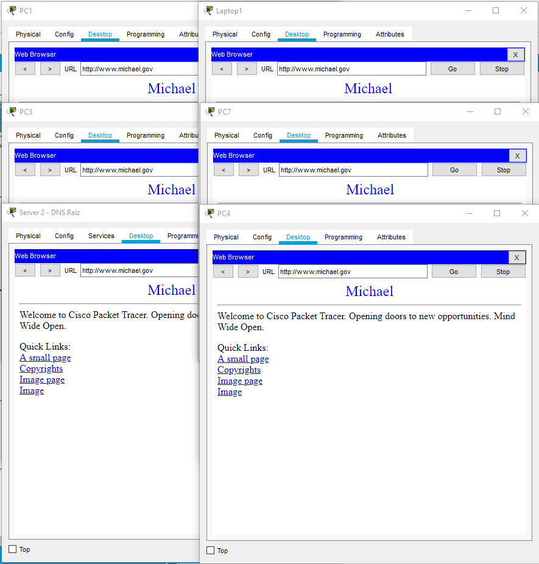

## Testes de Ping
### Testes Rápidos
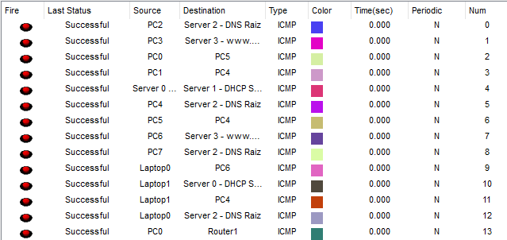
### PC0 -> PC4
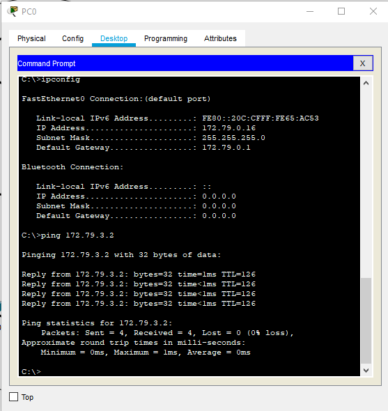
### Server2 -> Server1
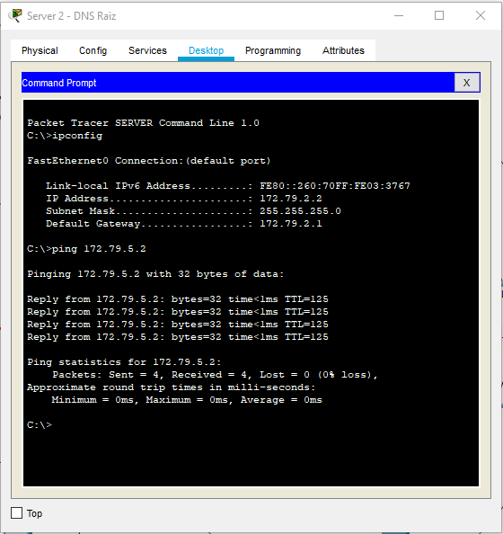
